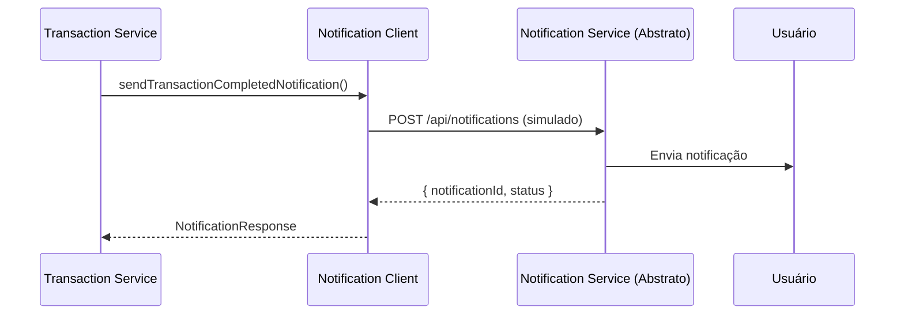

# Integração com Microsserviço de Notificações

Este documento descreve a interface e integração com o microsserviço de notificações, que é implementado de forma abstrata no sistema.

## Visão Geral

O microsserviço de notificações é responsável por enviar notificações aos usuários sobre eventos importantes do sistema, como transações concluídas ou falhadas. Como este serviço é abstrato (não possui implementação real), o cliente foi implementado com simulação de chamadas HTTP.

## Arquitetura

### Comunicação

O microsserviço de transações se comunica com o serviço de notificações de duas formas:

1. **Comunicação Assíncrona (Eventos)**: Via RabbitMQ, quando eventos são publicados
2. **Comunicação Síncrona (HTTP)**: Via cliente HTTP direto (simulado atualmente)

### Fluxo de Notificações



## Interface do Cliente

### NotificationClientService

O `NotificationClientService` implementa a interface `INotificationClient` e fornece métodos para comunicação com o serviço de notificações.

#### Métodos Disponíveis

##### 1. `sendNotification(notification, authToken?)`

Envia uma notificação genérica para um usuário.

**Parâmetros:**
- `notification: SendNotificationDto` - Dados da notificação
- `authToken?: string` - Token JWT opcional para autenticação

**Retorna:** `Promise<NotificationResponse>`

**Exemplo:**
```typescript
const notification: SendNotificationDto = {
  userId: '123e4567-e89b-12d3-a456-426614174000',
  type: NotificationType.TRANSACTION_COMPLETED,
  title: 'Transferência realizada',
  message: 'Você transferiu R$ 100.00',
  priority: NotificationPriority.HIGH,
  metadata: {
    transactionId: '789e4567-e89b-12d3-a456-426614174000',
  },
};

const response = await notificationClient.sendNotification(notification);
```

##### 2. `sendTransactionCompletedNotification(userId, transactionId, amount, isSender, authToken?)`

Envia notificação específica de transação concluída.

**Parâmetros:**
- `userId: string` - ID do usuário destinatário
- `transactionId: string` - ID da transação
- `amount: number` - Valor da transação
- `isSender: boolean` - Se o usuário é remetente (true) ou destinatário (false)
- `authToken?: string` - Token JWT opcional

**Retorna:** `Promise<NotificationResponse>`

**Exemplo:**
```typescript
// Notificação para remetente
await notificationClient.sendTransactionCompletedNotification(
  senderUserId,
  transactionId,
  100.50,
  true,
);

// Notificação para destinatário
await notificationClient.sendTransactionCompletedNotification(
  receiverUserId,
  transactionId,
  100.50,
  false,
);
```

##### 3. `sendTransactionFailedNotification(userId, transactionId, reason, authToken?)`

Envia notificação de transação falhada.

**Parâmetros:**
- `userId: string` - ID do usuário destinatário
- `transactionId: string` - ID da transação
- `reason: string` - Motivo da falha
- `authToken?: string` - Token JWT opcional

**Retorna:** `Promise<NotificationResponse>`

**Exemplo:**
```typescript
await notificationClient.sendTransactionFailedNotification(
  userId,
  transactionId,
  'Saldo insuficiente',
);
```

##### 4. `healthCheck()`

Verifica se o serviço de notificações está disponível.

**Retorna:** `Promise<boolean>`

**Exemplo:**
```typescript
const isAvailable = await notificationClient.healthCheck();
if (!isAvailable) {
  // Tratar indisponibilidade
}
```

## Contratos de API

### SendNotificationDto

```typescript
interface SendNotificationDto {
  userId: string;                    // UUID do usuário destinatário
  type: NotificationType;            // Tipo da notificação
  title: string;                     // Título da notificação
  message: string;                   // Mensagem da notificação
  metadata?: Record<string, unknown>; // Dados adicionais (opcional)
  priority?: NotificationPriority;    // Prioridade (opcional, padrão: 'normal')
}
```

### NotificationResponse

```typescript
interface NotificationResponse {
  notificationId: string;            // UUID da notificação criada
  status: 'sent' | 'queued' | 'failed'; // Status do envio
  timestamp: string;                 // ISO 8601 timestamp
  message?: string;                  // Mensagem de resposta (opcional)
}
```

### Tipos de Notificação

```typescript
enum NotificationType {
  TRANSACTION_COMPLETED = 'transaction.completed',
  TRANSACTION_FAILED = 'transaction.failed',
  ACCOUNT_UPDATE = 'account.update',
  SECURITY_ALERT = 'security.alert',
  SYSTEM_NOTIFICATION = 'system.notification',
}
```

### Prioridades

```typescript
enum NotificationPriority {
  LOW = 'low',
  NORMAL = 'normal',
  HIGH = 'high',
  URGENT = 'urgent',
}
```

## Implementação Atual (Simulada)

A implementação atual é **simulada** porque o microsserviço de notificações é abstrato. As características da simulação incluem:

### Comportamento Simulado

1. **Delay de Rede**: Simula delay de 50-200ms para simular latência de rede
2. **Resposta Bem-sucedida**: Retorna resposta com `notificationId` gerado e status `'sent'`
3. **Falha Ocasional**: 5% de chance de falha simulada para testes de resiliência
4. **Validação**: Valida todos os campos obrigatórios antes de "enviar"

### Migração para Implementação Real

Para migrar para uma implementação real, substitua o método `simulateHttpCall` por uma chamada HTTP real:

```typescript
// Exemplo de implementação real usando axios
import axios from 'axios';

private async makeHttpCall(
  notification: SendNotificationDto,
  authToken?: string,
): Promise<NotificationResponse> {
  const headers: Record<string, string> = {
    'Content-Type': 'application/json',
  };

  if (authToken) {
    headers['Authorization'] = `Bearer ${authToken}`;
  }

  const response = await axios.post<NotificationResponse>(
    `${this.baseUrl}/api/notifications`,
    notification,
    {
      headers,
      timeout: this.timeout,
    },
  );

  return response.data;
}
```

## Uso no Transaction Service

### Injeção de Dependência

```typescript
import { NotificationClientService } from '../clients/notification-client.service';

@Injectable()
export class TransactionsService {
  constructor(
    private readonly notificationClient: NotificationClientService,
    // ... outros serviços
  ) {}
}
```

### Exemplo de Uso

```typescript
// Após criar uma transação com sucesso
try {
  // Notificar remetente
  await this.notificationClient.sendTransactionCompletedNotification(
    senderUserId,
    transaction.id,
    amount,
    true,
    authToken,
  );

  // Notificar destinatário
  await this.notificationClient.sendTransactionCompletedNotification(
    receiverUserId,
    transaction.id,
    amount,
    false,
    authToken,
  );
} catch (error) {
  // Log do erro, mas não falha a transação
  this.logger.error('Erro ao enviar notificações:', error);
}
```

## Tratamento de Erros

### Erros de Validação

O cliente valida os dados antes de enviar e lança `HttpException` com status `BAD_REQUEST` se:
- `userId` estiver vazio ou não for UUID válido
- `type` não for fornecido
- `title` estiver vazio
- `message` estiver vazio

### Erros de Comunicação

Em caso de erro na comunicação (serviço indisponível, timeout, etc.), o cliente lança `HttpException` com status `SERVICE_UNAVAILABLE`.

### Boas Práticas

1. **Não falhar a transação por erro de notificação**: Sempre trate erros de notificação sem afetar o fluxo principal
2. **Logging**: Sempre registre erros de notificação para auditoria
3. **Retry**: Em produção, considere implementar retry com backoff exponencial
4. **Circuit Breaker**: Considere implementar circuit breaker para evitar sobrecarga quando o serviço está indisponível

## Configuração

### Variáveis de Ambiente

```env
# URL do serviço de notificações
NOTIFICATION_SERVICE_URL=http://notification-service:3003

# Timeout para chamadas HTTP (em ms)
NOTIFICATION_SERVICE_TIMEOUT=5000
```

### Módulo NestJS

O `NotificationClientService` está registrado no `ClientsModule`:

```typescript
@Module({
  providers: [UserClientService, NotificationClientService],
  exports: [UserClientService, NotificationClientService],
})
export class ClientsModule {}
```

## Testes

### Testes Unitários

Os testes unitários estão em `notification-client.service.spec.ts` e cobrem:

- Envio de notificações genéricas
- Envio de notificações de transação concluída
- Envio de notificações de transação falhada
- Validação de dados de entrada
- Health check

### Executar Testes

```bash
npm test notification-client.service.spec
```

## Integração com Eventos RabbitMQ

Além da comunicação HTTP direta, o sistema também publica eventos no RabbitMQ que podem ser consumidos pelo serviço de notificações:

### Eventos Publicados

1. **transaction.completed**: Publicado quando uma transação é concluída
2. **transaction.failed**: Publicado quando uma transação falha

Veja `docs/MESSAGING_PATTERNS.md` para mais detalhes sobre os eventos.

## Próximos Passos

Para implementar o serviço de notificações real:

1. [ ] Criar microsserviço de notificações (NestJS)
2. [ ] Implementar endpoints REST:
   - `POST /api/notifications` - Criar notificação
   - `GET /api/notifications/health` - Health check
3. [ ] Implementar consumidor de eventos RabbitMQ
4. [ ] Substituir simulação por chamadas HTTP reais
5. [ ] Implementar retry e circuit breaker
6. [ ] Adicionar métricas e monitoramento

## Referências

- [Contratos de API Globais](../../../docs/NOTIFICATION_SERVICE_API_CONTRACTS.md) - Documentação completa dos contratos de API
- [Interface do Cliente](./src/clients/interfaces/notification-client.interface.ts)
- [DTOs](./src/clients/dto/send-notification.dto.ts)
- [Implementação](./src/clients/notification-client.service.ts)
- [Padrões de Mensageria](../../../docs/MESSAGING_PATTERNS.md)
- [Contratos de Eventos](../../../docs/schemas/EVENT_CONTRACTS.md)

---
